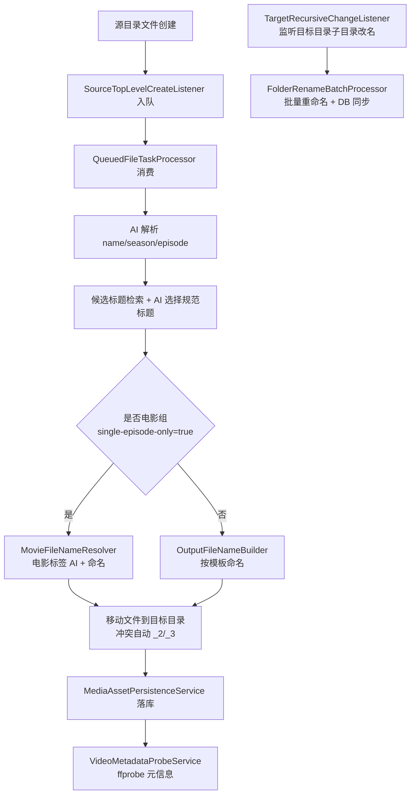

# warehouse-manager

基于 Quarkus 的媒体文件监听、AI 解析、重命名、归档、落库系统。支持多目录分组监听（剧集/电影等），并在目标目录改名时同步更新数据库与文件路径。

## 1. 项目简介

### 1.1 一句话说明
`warehouse-manager` 通过监听文件系统事件，把媒体文件从“源目录”自动整理到“目标目录”，并将元信息持久化到 MySQL。

### 1.2 核心能力
- 白名单监听：仅处理命中 `watch.allow-file-names` 的文件。
- 双层 AI 判别：
  - 第一层：解析文件名（剧名/季号/集号）。
  - 第二层：候选标题判别（从数据库候选中选规范标题）。
- 电影标签 AI：识别 `正片/预告片/花絮/特典/其他`，并规范输出电影文件名。
- 防覆盖重命名：同名冲突自动追加 `_2/_3...`，禁止覆盖已有文件。
- MySQL 持久化：
  - `media_asset` 保存影视元信息。
  - `media_asset_video_file` 保存视频资产明细（权威来源）。
  - `media_asset_subtitle_file` 保存字幕文件名集合。
- ffprobe 元信息：自动采集分辨率、编码、时长、体积，失败降级为空并记录告警。
- 配置同步：启动时将配置快照写入 `watch_config_entry` 并检测差异。

## 2. 核心流程



### 2.1 两个监听器职责
- `SourceTopLevelCreateListener`：监听各分组 `sourceRoot` 表层文件创建事件并入队。
- `TargetRecursiveChangeListener`：监听各分组 `targetRoot` 下一层子目录的创建/删除组合事件，识别目录重命名并触发批处理。

## 3. 项目结构

### 3.1 关键包
- `com.orlando.watch.listener`：文件系统监听（源文件创建、目标目录改名）。
- `com.orlando.watch.processor`：任务处理与目录改名批处理。
- `com.orlando.watch.naming`：命名模板渲染、电影命名解析、防冲突命名。
- `com.orlando.watch.persistence`：落库规则、ffprobe 元信息采集与回填。
- `com.orlando.watch.service`：标题候选检索与 AI 判别归并。
- `com.orlando.media.ai`：LangChain4j AI 接口定义。
- `com.orlando.entity / repository`：实体与数据访问层。

### 3.2 关键类速览
- `SourceTopLevelCreateListener`：源目录监听并入队。
- `QueuedFileTaskProcessor`：主链路处理（解析 -> 命名 -> 移动 -> 落库）。
- `MovieFileNameResolver`：电影标签判别与命名。
- `FolderRenameBatchProcessor`：目录改名后文件与 DB 同步。
- `MediaAssetPersistenceService`：视频/字幕分流落库。
- `WatchConfigurationSyncService`：配置差异检测与同步。

## 4. 环境要求

- JDK：`25`
- 构建：Maven Wrapper（`./mvnw`）
- 数据库：MySQL `8.x`
- 媒体探测：`ffprobe`（需要在 `PATH` 可执行）
- 操作系统：macOS / Linux（路径分隔符不同，自行替换示例路径）

建议先验证：

```bash
java -version
./mvnw -v
mysql --version
ffprobe -version
```

## 5. 配置说明（重点）

### 5.1 配置加载链
系统通过 `quarkus.config.locations` 加载配置，默认顺序为：

1. `.env`
2. `../.env`
3. `../../.env`
4. `database.properties`
5. `logger.properties`
6. `watch-processing.properties`

可通过 JVM 参数覆盖：

```bash
-DWAREHOUSE_CONFIG_LOCATIONS=/abs/path/.env,/abs/path/database.properties,/abs/path/logger.properties,/abs/path/watch-processing.properties
```

### 5.2 环境变量契约

| 变量名 | 必填 | 说明 | 示例 |
|---|---|---|---|
| `OPENAI_API_KEY` | 是 | AI 服务密钥 | `<YOUR_OPENAI_API_KEY>` |
| `MYSQL_URL` | 是 | JDBC 地址 | `jdbc:mysql://127.0.0.1:3306/warehouse_manager?...` |
| `MYSQL_USERNAME` | 是 | DB 用户名 | `root` |
| `MYSQL_PASSWORD` | 是 | DB 密码 | `<YOUR_DB_PASSWORD>` |
| `WATCH_GROUP_<NAME>_PATH` | 是 | 分组源目录 | `/data/source-series` |
| `WATCH_GROUP_<NAME>_TARGET_PATH` | 是 | 分组目标目录 | `/data/target-series` |
| `WATCH_GROUP_<NAME>_SINGLE_EPISODE_ONLY` | 是 | 是否电影单集模式 | `true/false` |
| `QUARKUS_LOG_CONSOLE_ENABLE` | 否 | 是否控制台输出日志 | `false` |

> `<NAME>` 示例：`SERIES`、`MOVIE`、`DSJ`。

### 5.3 `.env` 示例（多分组）

```dotenv
OPENAI_API_KEY=<YOUR_OPENAI_API_KEY>
MYSQL_URL=jdbc:mysql://127.0.0.1:3306/warehouse_manager?useUnicode=true&characterEncoding=UTF-8&serverTimezone=Asia/Shanghai
MYSQL_USERNAME=root
MYSQL_PASSWORD=<YOUR_DB_PASSWORD>

QUARKUS_LOG_CONSOLE_ENABLE=false

WATCH_GROUP_SERIES_PATH=/data/source-series
WATCH_GROUP_SERIES_TARGET_PATH=/data/target-series
WATCH_GROUP_SERIES_SINGLE_EPISODE_ONLY=false

WATCH_GROUP_MOVIE_PATH=/data/source-movie
WATCH_GROUP_MOVIE_TARGET_PATH=/data/target-movie
WATCH_GROUP_MOVIE_SINGLE_EPISODE_ONLY=true

WATCH_GROUP_DSJ_PATH=/data/source-dsj
WATCH_GROUP_DSJ_TARGET_PATH=/data/target-dsj
WATCH_GROUP_DSJ_SINGLE_EPISODE_ONLY=false
```

### 5.4 `watch-processing.properties` 关键项

```properties
watch.allow-file-names=re:.*\.(m4v|mp4|mkv|ass|ssa|srt|vtt)$
watch.filename.pattern={name}_s{snumber}.e{enumber}.{ext}
watch.filename.season-number-width=2
watch.filename.episode-number-width=2
watch.db.asset-file-extensions=mp4,mkv,m4v
watch.db.subtitle-file-extensions=ass,srt,ssa,vtt
```

说明：
- `watch.allow-file-names`：白名单规则（精确值或 `re:` 正则）。
- `watch.filename.pattern`：剧集命名模板。
- `season/episode-number-width`：季号/集号补零位数。
- `asset-file-extensions`：可落入视频资产表的扩展名。
- `subtitle-file-extensions`：仅落入字幕集合的扩展名。

## 6. 命名规则

### 6.1 剧集模式（`single-episode-only=false`）
按模板输出，例如：

```text
{name}_s{snumber}.e{enumber}.{ext}
```

示例：`Oujougiwa no Imi wo Shire!_s01.e07.mp4`

### 6.2 电影模式（`single-episode-only=true`）
- 正片：`name.ext`
- 非正片：`name{edition-标签}.ext`
- 冲突：自动 `_2/_3...`

示例：
- `超时空辉夜姬.mkv`
- `超时空辉夜姬{edition-预告片}.mkv`
- `超时空辉夜姬{edition-预告片}_2.mkv`

### 6.3 电影标签规则
AI 标签集合：`正片 / 预告片 / 花絮 / 特典 / 其他`

当前实现规则：
- 若文件名无显式标签且 AI 不确定，默认按 `正片` 处理。
- 仅在明确命中标签（如 `Trailer`、`预告`、`{edition-其他}`）时才输出对应标签。

## 7. 数据库模型

> 当前策略：`media_asset` 元信息化，视频资产统一入 `media_asset_video_file`。

### 7.1 `media_asset`（影视元信息）
核心字段：
- `id`
- `title`
- `season`
- `episode`
- `folder_path`
- `content_type`（`MOVIE` / `SERIES`）

### 7.2 `media_asset_video_file`（视频资产权威表）
核心字段：
- `id`
- `media_asset_id`（外键）
- `file_name`
- `file_path`（唯一）
- `file_ext`
- `edition_tag`
- `video_width` / `video_height`
- `video_codec` / `audio_codec`
- `duration_ms` / `file_size_bytes`

### 7.3 `media_asset_subtitle_file`（字幕集合）
核心字段：
- `media_asset_id`
- `subtitle_file_name`

### 7.4 `watch_config_entry`（配置快照）
核心字段：
- `config_key`
- `config_value`
- `config_source`

### 7.5 关系
- `media_asset (1) -> (N) media_asset_video_file`
- `media_asset (1) -> (N) media_asset_subtitle_file`

## 8. 启动与运行

### 8.1 开发模式

```bash
./mvnw quarkus:dev
```

### 8.2 打包

```bash
./mvnw package
```

### 8.3 运行可执行 JAR

```bash
java -jar target/quarkus-app/quarkus-run.jar
```

### 8.4 指定配置源运行（覆盖 `.env` 搜索路径）

```bash
java \
  -DWAREHOUSE_CONFIG_LOCATIONS=/abs/path/.env,/abs/path/database.properties,/abs/path/logger.properties,/abs/path/watch-processing.properties \
  -jar target/quarkus-app/quarkus-run.jar
```

### 8.5 日志
- 文件日志：`logs/app.log`
- 可通过 `QUARKUS_LOG_CONSOLE_ENABLE=false` 关闭控制台输出（仅写文件）。

## 9. 验证示例（端到端）

> 下述示例假设：
> - 剧集组：`singleEpisodeOnly=false`
> - 电影组：`singleEpisodeOnly=true`

### 场景 A：剧集文件入库与命名

输入（放入源目录）：

```text
[MagicStar] Oujougiwa no Imi wo Shire! EP07 [1080p].mp4
```

期望：
- 文件移动到目标目录：

```text
/data/target-series/Oujougiwa no Imi wo Shire!/Oujougiwa no Imi wo Shire!_s01.e07.mp4
```

- 数据库校验：

```sql
SELECT ma.title, ma.season, ma.episode, mvf.file_name, mvf.file_path
FROM media_asset ma
JOIN media_asset_video_file mvf ON mvf.media_asset_id = ma.id
WHERE ma.title = 'Oujougiwa no Imi wo Shire!' AND ma.season = 1 AND ma.episode = 7;
```

### 场景 B：电影正片 + 预告片防覆盖

输入（同一电影源目录先后放入）：

```text
超时空辉夜姬.mkv
超时空辉夜姬 - Trailer.mkv
```

期望：

```text
/data/target-movie/超时空辉夜姬/超时空辉夜姬.mkv
/data/target-movie/超时空辉夜姬/超时空辉夜姬{edition-预告片}.mkv
```

数据库校验：

```sql
SELECT ma.title, mvf.file_name, mvf.edition_tag
FROM media_asset ma
JOIN media_asset_video_file mvf ON mvf.media_asset_id = ma.id
WHERE ma.title = '超时空辉夜姬'
ORDER BY mvf.file_name;
```

### 场景 C：目标目录改名联动

操作：
- 在目标目录将 `Ranma ½` 改名为 `Ranma ½ 2024`

期望：
- `media_asset.title` / `media_asset.folder_path` 同步更新。
- `media_asset_video_file.file_name` / `file_path` 同步更新到新目录。

数据库校验：

```sql
SELECT title, folder_path FROM media_asset WHERE title LIKE 'Ranma%';

SELECT mvf.file_name, mvf.file_path
FROM media_asset_video_file mvf
JOIN media_asset ma ON ma.id = mvf.media_asset_id
WHERE ma.title LIKE 'Ranma%'
ORDER BY mvf.file_name;
```

## 10. 常见问题与排障

### 10.1 `ContextNotActiveException`（后台线程调用 AI）
现象：监听线程里调用 AI，报 `RequestScoped context was not active`。

定位：
- 通常发生在自建线程直接调用 `@RegisterAiService` 代理。

当前实现：
- `QueuedFileTaskProcessor`、`FolderRenameBatchProcessor` 已通过 `@ActivateRequestContext` 处理请求上下文。

### 10.2 `ffprobe` 报 `moov atom not found`
含义：文件容器损坏/不完整/非真实 MP4，不是命名规则问题。

排查建议：

```bash
ffprobe -v error -print_format json -show_streams -show_format <file>
file <file>
```

### 10.3 `Configuration validation failed`
常见原因：`watch.group.*` 环境变量为空字符串，导致配置映射失败。

检查：
- `.env` 是否包含所有分组的 `PATH/TARGET_PATH/SINGLE_EPISODE_ONLY`
- 是否误写成空值（`KEY=`）。

### 10.4 目录改名后未同步
排查顺序：
1. 查看 `TargetRecursiveChangeListener` 日志是否识别到 `删除+创建` 配对事件。
2. 检查 `FolderRenameBatchProcessor` 是否执行。
3. 核查磁盘路径与 DB `file_path` 是否一致。
4. 检查目标目录是否跨父目录移动（跨父目录不属于同一次 rename 配对）。

## 11. 测试与质量检查

### 11.1 单元测试

```bash
./mvnw -q -Dtest=MovieFileNameResolverTest,FolderRenameBatchProcessorPatternTest test
```

### 11.2 编译检查

```bash
./mvnw -q -DskipTests compile
```

### 11.3 README 自检清单
- 命令可复制执行。
- 配置键与代码一致（`watch.*`、环境变量名一致）。
- 示例 SQL 对应真实表结构。
- 无密钥/密码/token。

## 12. 安全与合规

- 禁止提交 `.env`（已在 `.gitignore`）。
- 所有敏感信息通过环境变量注入，不在代码和 README 明文出现。
- 若历史提交曾泄露敏感信息：
  1. 立即轮换凭据。
  2. 重写 Git 历史并强推。
  3. 通知协作者重新同步仓库。

## 13. 版本与后续计划

### 13.1 当前能力边界
- 当前项目以文件监听 + AI 命名 + 落库为主。
- `pom.xml` 中 MCP 相关依赖目前处于注释状态，未启用 MCP 服务端入口。
- 当前无对外业务 HTTP API 文档章节（后续新增再补）。

### 13.2 Roadmap（建议）
- 增加 DB migration 工具（如 Flyway/Liquibase）统一表结构演进。
- 为目录改名批处理增加更多集成测试样例。
- 增加“坏文件隔离目录”策略（ffprobe 失败自动移入隔离区）。

## 对外接口/类型变更说明

本次仅重写文档，不改代码接口、不改数据库结构。

本 README 固化以下契约：
1. 环境变量契约：变量名、必填项、默认行为。
2. 配置键契约：`watch.*` 命名模板与位宽语义。
3. 数据模型语义契约：`media_asset` 元信息化、`media_asset_video_file` 为视频权威来源。

## 验收场景

1. 文档命令验收：README 命令可执行。
2. 配置映射验收：按示例配置后监听线程正常启动。
3. 流程验收：新增文件后命名、移动、落库符合预期。
4. 故障验收：损坏视频触发 ffprobe 告警但主流程不中断。
5. 安全验收：README 无任何真实敏感信息。
